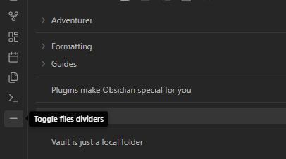
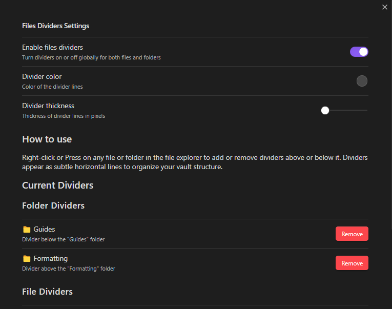

# Obsidian Files Divider Plugin

A plugin that adds visual dividers between files and folders in the file explorer to help organize your notes

## Usage

### Adding Dividers

1. **Right-click/press Method** - Right-click or press on any folder or file in the file explorer and select "Add divider above" or "Add divider below"
2. **Settings Method** - Open plugin settings to manage all dividers manually

### Managing Dividers

- Open Settings 👉 Community Plugins 👉 Files Divider
- View all current dividers
- Remove unwanted dividers
- Customize divider appearance (color, thickness)
- Use the command palette to toggle dividers on/off or clear all dividers

## Example

```
📁Academic
---          👈 Divider added above 📁Animals
📁Animals
---          👈 Divider added below 📁Animals
📁Science
📁Technology
📁Engineering
📁Mathematics
---          👈 Divider added below 📁Mathematics
📁Foo
📄Start Here.md
---          👈 Divider added above 📄TODO.md
📄TODO.md
```

## Toggle Dividers



## Settings

- **Divider Color** - Choose the color of divider lines
- **Divider Thickness** - Adjust line thickness (1-5px)
- **Divider Management** - View and remove existing dividers



## Commands

- Toggle folder dividers
- Clear all folder dividers

Access via Command Palette (Ctrl/Cmd + P)

## Installation

### Manual Installation

1. Download the latest release files (`main.js`, `manifest.json`)
2. Copy them to `YourVault/.obsidian/plugins/files-dividers/`
3. Reload Obsidian
4. Enable the plugin in Settings → Community Plugins

### Development Setup

```bash
# Clone to your plugins folder
cd YourVault/.obsidian/plugins/
git clone https://github.com/rqinix/Obsidian-Files-Divider obsidian-files-divider

# Install dependencies
cd obsidian-files-divider
npm install

# Build the plugin
npm run build

# Or run in development mode
npm run dev
```

## Support and Contributing

If you encounter issues or have feature requests or want to improve this, open an issue or pull request

## License

MIT
